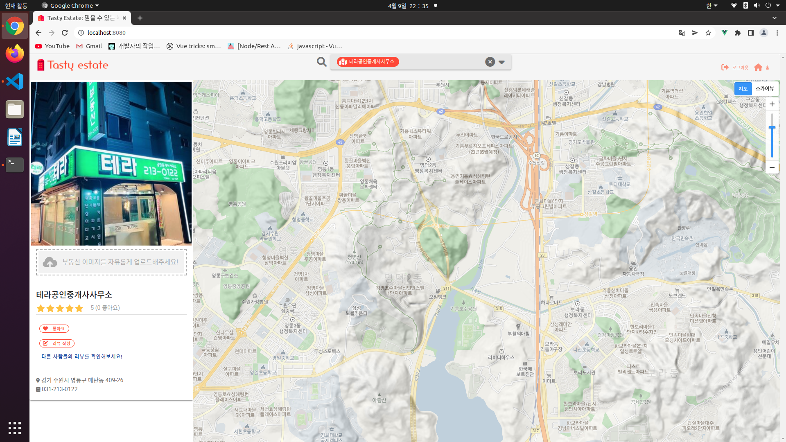

## 🍰 TastyEstate

    

이 프로젝트는 대한민국 부동산 평점 시스템입니다.  
간편하게 지역 근처에 부동산 평점을 검색해 보세요 👓

## Project Summary 📝

부동산 평점 관리 서비스

#### 🔸 제안 배경

- 기존 부동산 관련 서비스는 매물에 관련된 가격/위치 정보밖에 제공하지 않음
- 부동산에서 허위매물을 올리는등 부동산 신뢰도 하락
- 믿을 수 있는 부동산 정보에 대한 요구 증가

#### 🔸 서비스 컨셉

- 검색한 위치 근처 부동산을 추천해주는 서비스

#### 🔸 타겟

- 믿을 수 있는 부동산 중계업소를 알고 싶은 사람

 

## Reference APIs

- [KAKAO development APIs](https://developers.kakao.com/)
